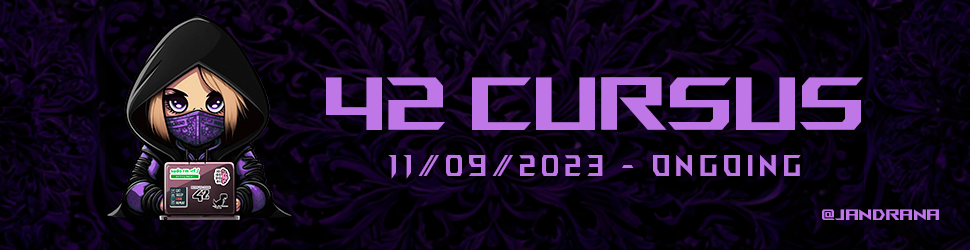

<p align="center"></p>

Welcome to my **42Cursus** repository! This is where I'll be sharing all the projects I work on during my time as a student in 42Malaga.

The purpose of this repository is to keep track of my journey as a coding student at 42. Here, you'll find the projects I develop as part of my 42 experience. 

Feel free to explore, provide feedback, and follow along!

## Table of content

- [Cursus Projects and Exams Tables](#-cursus-tables)
- [Project Descriptions](#-project-descriptions)
   - [Level 2: push_swap](#level-2-push_swap)
   - [Level 2: so_long](#level-2-so_long)
   - [Level 2: minitalk](#level-2-minitalk)
   - [Level 1: get_next_line](#level-1-get_next_line)
   - [Level 1: ft_printf](#level-1-ft_printf)
   - [Level 1: born2beroot](#level-1-born2beroot)
   - [Level 0: libft](#level-0-libft)
- [Exams](#-exams)
- [42Utils](#-42utils)
- [Usage](#-usage)
- [Feedback](#-feedback)
- [Contact Me](#-contact-me)
- [Acknowledgments](#-acknowledgments)
- [Important Notes](#important-notes-)

## 📁 Cursus Tables

<ul><details><summary>Project ⏬</summary>
<table width="100" align="center">
   <thead>
      <th>Level</th>
      <th>Project</th>
      <th>Grade</th>
      <th>Submission</th>
   </thead>
   <tbody>
      <tr>
         <td align="center">0</td>
         <td align="center"><a href="https://github.com/jandrana/libft"></a><br>Libft</td>
         <td align="center">125/100</td>
         <td><a href="https://github.com/jandrana/libft">18/09/2023</a></td>
      </tr>
      <tr>
         <td rowspan="3" align="center">1</td>
         <td align="center"><a href="https://github.com/jandrana/ft_printf"></a><br>ft_printf</td>
         <td align="center">100/100</td>
         <td><a href="https://github.com/jandrana/ft_printf">25/09/2023</a></td>
      </tr>
      <tr>
         <td align="center"><a href="https://github.com/jandrana/get_next_line"></a><br>get_next_line</td>
         <td align="center">125/100</td>
         <td><a href="https://github.com/jandrana/get_next_line">02/10/2023</a></td>
      </tr>
      <tr>
         <td align="center"><a href=""></a><br>Born2beroot</td>
         <td align="center">125/100</td>
         <td>17/10/2023</td>
      </tr>
      <tr>
         <td rowspan="3" align="center">2</td>
         <td align="center"><a href="https://github.com/jandrana/push_swap"></a><br>push_swap</td>
         <td align="center">125/100</td>
         <td><a href="https://github.com/jandrana/push_swap">14/03/2024</a></td>
      </tr>
      <tr>
         <td align="center"><a href="https://github.com/jandrana/so_long"></a><br>so_long</td>
         <td align="center">125/100</td>
         <td><a href="https://github.com/jandrana/so_long">15/04/2024</a></td>
      </tr>
      <tr>
         <td align="center"><a href="https://github.com/jandrana/minitalk"></a><br>minitalk</td>
         <td align="center">125/100</td>
         <td><a href="https://github.com/jandrana/minitalk">19/04/2024</a></td>
      </tr>
      <tr>
         <td rowspan="2" align="center">3</td>
         <td align="center"><a href="https://github.com/jandrana/minishell"></a><br>minishell</td>
         <td align="center" colspan="2">❓</td>
      </tr>
      <tr>
         <td align="center"><a href="https://github.com/jandrana/philosophers"></a><br>Philosophers</td>
         <td align="center" colspan="2">❓</td>
      </tr>
   </tbody>
</table>
<table width="100" align="center">
   <thead>
      <th colspan="3">Badge Colours - Legend</th>
   </thead>
   <tbody>
      <tr align="center">
         <td><strong>⚫️ In progress</strong></td>
         <td><strong>🔵 Finished</strong></td>
         <td><strong>⭐️ Finished + bonus</strong></td>
      </tr>
      <tr align="center">
         <td></td>
         <td></td>
         <td></td>
      </tr>
   </tbody>
</table>
</details>

<details><summary>Exams ⏬</summary>
<table width="100" align="center">
   <thead>
      <th align="center">Level</th>
      <th align="center">Exam<br></th>
      <th align="center">Submission(s)</th>
      <th align="center">Grade</th>
   </thead>
   <tr>
      <td align="center">2</td>
      <td>Exam Rank 02</a></td>
      <td align="center">19/10/2023</td>
      <td align="center">100/100 🌟</td>
   </tr>
   <tr>
      <td align="center">3</td>
      <td><a href="https://github.com/jandrana/42-Cursus/tree/main/Exams/Exam_Rank_03">Exam Rank 03</a></td>
      <td align="center">03/05/2024</a></td>
      <td align="center">100/100 🌟</td>
   </tr>
   <tr>
      <td colspan="4">Remember that in order to pass an exam you have to get the maximum grade (100)</td>
   </tr>
</table>
</details></ul>

## 📄 Project Descriptions

### Level 2: [push_swap](https://github.com/jandrana/push_swap)

The `push_swap` project is a fundamental algorithmic challenge where you have to sort data in the most effective way possible. You're given a stack of integers, two stacks to manipulate, and a limited set of actions. The objective is to write a C program called `push_swap` that calculates and displays the smallest set of actions necessary to sort the initial stack. Developed within the project's guidelines, my program efficiently sorts the provided input.

Being able to complete this project meant a big step forward in my learning path since I consider it to be much more difficult that any other projects that I have developed in C so far. I believe it is the project I learnt the most from and it is definitely the one I have enjoyed most so far.

Things to highlight as learnt with this project:
 - Development, optimization and implementation of sorting algorithms
 - Utilization and deeper comprehension of data structures (double linked lists)

### Level 2: [so_long](https://github.com/jandrana/so_long)

The `so_long` project is a small 2D game development project that makes use of the [MLX42](https://github.com/codam-coding-college/MLX42) library (Codam 42 Students "own fixed, functioning and open-source alternative to the MiniLibX"). The objective of the project is to create a simple game where a player moves through a map with the goal of collecting all the items available by avoiding obstacles and enemies before reaching the exit.

Completing this project required thoroughly parsing map files to meet specific critieria, ensuring they were valid and correctly rendered. This project taught me basic game mechanics, graphics rendering and event handling in C. 

General steps taken for completing the project:
 - Implemented [MLX42](https://github.com/codam-coding-college/MLX42) for graphics rendering
 - Ensured map validation and error handling
 - Created a functional 2D game environment based on parsed map data
 - Ensured the complete project was leak free.

### Level 2: [minitalk](https://github.com/jandrana/minitalk)

The `minitalk` project involves creating a data exchange program using UNIX signals. It consists of a server and a client executable, where the client sends messages to the server via SIGUSR1 and SIGUSR2 signals. The server reconstructs the message and displays it.

This project deepened my understanding of inter-process communication and signal handling in UNIX, and taught me about reliable data transfers, error handling and managing Unicode characters.

Key achievements:
 - Implemented server confirmation for each received signal
 - Added support for Unicode characters
 - Enhanced skills in data transfer reliability and error handling

### Level 1: [get_next_line](https://github.com/jandrana/get_next_line)

The `get_next_line` project focuses on developing a function that reads content from a file descriptor line by line. With this project I got the opportunity to really understand how to prevent memory leaks and how to allocate just the neccessary space in order to increase the optimization of the code. Furthermore, with the bonus files, not only you can read content from one but from as many file descriptor as you want without losing track of what line you have to return next.

### Level 1: [ft_printf](https://github.com/jandrana/ft_printf)

In the `ft_printf` project, I replicated the functionality of the standard `printf` function in C. The main challenge of this project was to learn how variadic functions work and how to use them, which involved handling the formatting and printing of text with different data types. Completing this project made possible adding it to my "libft" library for future use.


### Level 1: born2beroot

With the `born2beroot` project I learned to create and configure a VM with Debian (without graphical interface). After installing the VM I got to install and configure the following programs/services: sudo (including commands logs), ssh, ufw, wordpress (mariadb, php, openlitespeed). The project also included the development of a sh script that showed general information of the virtual machine every 10 minutes. Information like: VM architecture, RAM load, CPU load, ip and MAC address, number of: vCPU, TCP connections, sudo commands done...


### Level 0: [libft](https://github.com/jandrana/libft)

The `libft` project is the first one of my journey as a 42 student and has played a crucial role in upcoming assignments, since the library created here is used in upcoming projects. Here, I created my very first C library from scratch.

This project pushed me to deeply understand how the original replicated functions work, helping me develop a more comprehensive understanding of their inner workings and how to enhance them. It's not just about meeting project requirements; it's about making the best possible library since it will become the base of many other projects.

## 🔖 Exams

The Exam folder contains my own solutions to various exam questions present in the 42 experience. Each solution is documenteed with a README that explains the approach and methodology used to arrive to the answer. They cover a variety of topics and are designed to test comprehensive understanding and problem-solving skills. Some solutions were developed for practice, study and mentoring purposes. While I am confident in their functionality, some have not been verified in an offical exam environment.

These answers are meant for teaching and mentoring; never rely on someone else's code to pass an exam. Focus on understanding the solutions rather than memorizing them.

## 📈 42Utils

The 42Utils folder contains a collection of scripts I have developed to help students with various tasks, with the objective of improving productivity. Repositories that you can find in the 42Utils folder include:
 - [42cleaner](https://github.com/jandrana/42cleaner): Script designed to clean cache and temporary files for 42 students using Linux/Ubuntu. It helps to free up disk space and maintain system performance.
 - [42python_install](https://github.com/jandrana/42python_install/): Script designed to automate the task of installing a user version of Python using "pyenv" without needing root/sudo permissions.

## 🔧 Usage

This repository is intended for academic and educational purposes. It is meant to showcase my progress as a student in the 42Cursus. Please use it responsibly.

### Testing the Projects

To test the projects in this repository, you'll need access to a compatible development environment. The following instructions provide a general guideline:

1. **Operating System Compatibility:** The projects in this repository are primarily designed for Unix-like operating systems. It is recommended to use macOS or a Linux distribution (e.g., Ubuntu) for optimal compatibility.

2. **Prerequisites:** Ensure that you have the necessary tools and compilers installed, such as `gcc` for C projects. You may also need specific libraries or dependencies, which will be documented within each project's directory.

3. **Compilation:** Check if the project you want to compile contains a Makefile. If there's a Makefile present, navigate to the project's directory and use the `make` command to build it. If there is no Makefile, compile as preferred. For example:

   ```bash
   cd project_folder
   make

Please note that these are general guidelines, and each project may have its own specific setup and testing requirements. Check on the project's individual README for detailed instructions on how to test the project.
## ✨ Feedback

I warmly welcome feedback and contributions to this repository. If you find any issues, have suggestions for improvements, or would like to collaborate, please don't hesitate to reach out.

- You can [open an issue](https://github.com/jandrana/42-Cursus/issues) to report problems or propose enhancements.
- Additionally, feel free to [contact me](#contact-me) directly if you have any questions or ideas to share.

## 👋 Contact me

- Github: [@jandrana](https://github.com/jandrana)
- 42 login: [ana-cast](https://profile.intra.42.fr/users/ana-cast)
- Mail: yo@anaalejandra.com

Feel free to contact me!
## 💌 Acknowledgments

I would like thank all the following individuals and resources who have contributed to the development of the projects in this repository:

- The 42 Students Community: I would like to thank to all the 42 students who have supported and guided from my very first day in 42Malaga.

- [Francinette](https://github.com/xicodomingues/francinette): A comprehensive project tester that helped ensure the robustness of my code.

- [42make](https://github.com/Nimon77/42make): An inspiration and reference for creating efficient Makefiles for my projects.

- [ASCII Art Generator](https://patorjk.com/software/taag/#p=testall&c=echo&f=Arrows&t=ft_printf): A helpful online tool for creating stylish headers and drawings for the Makefiles.

---

### Important Notes ❗

This repository is continuously updated as I progress through each project. Latest projects may be unfinished or contain errors (check [Projects Table](#-cursus-tables) for status).

⚠️ **Warning:** This repository is a learning resource tracking my personal progress. Use it to enhance your understanding and skills, but do not copy the code for your 42 projects. Misuse can lead to a cheating grade and hinder your academic growth.

---